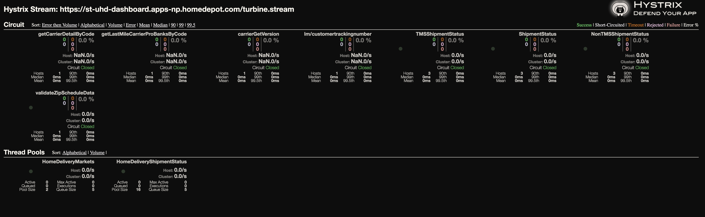

# HystrixDashboard

Hystrix is a latency and fault tolerance library designed to isolate points of access to remote systems, services and 3rd party libraries, stop cascading failure and enable resilience in complex distributed systems where failure is inevitable.

### GitHub Documentation

This project is based on [Netflix Hystrix](https://github.com/Netflix/Hystrix)
 
##Screenshots




## How to run

Access the dashboard via the Eureka endpoint

### Interactions 

This API interacts with the following:

```
All UnBundled PCF Applications
```


## Deployment

Add spring boot starter actuator the build.gradle file for each API needing to be registered with Hystrix 

## Contributors

The greatest Home Depot Homedelivery Unbundled Services.


"# UHDHystrixDashboard" 
"# UHDHystrixDashboard" 
